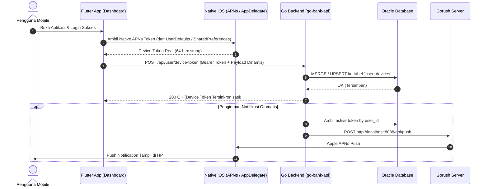

# Rencana Implementasi: Pendaftaran Device Token Otomatis & Seamless (Self-Hosted Push via Gorush, Bebas Firebase)

> **Untuk Pengerjaan Bertahap**: Mengikuti alur Spec-Driven Development (Plan -> Code -> Validate -> Iterate).

**Tujuan:**
Mengotomatiskan pengambilan token perangkat native (APNs untuk iOS) di aplikasi Flutter secara natural dan dinamis dari OS (tanpa hardcode & tanpa ketergantungan Firebase SDK), lalu menyimpannya ke database Oracle melalui Go API setiap kali pengguna login atau saat token diperbarui, serta memungkinkan Go backend memicu push notifikasi langsung ke Gorush.

---

## Arsitektur & Alur Kerja

---

## Komponen & File yang Terlibat

### 1. Database (Oracle)
- **Tabel:** `user_devices`
  - `id`: NUMBER GENERATED ALWAYS AS IDENTITY PRIMARY KEY
  - `id_app_users`: NUMBER NOT NULL (FK ke `app_users(id)`)
  - `device_token`: VARCHAR2(255) NOT NULL UNIQUE
  - `platform`: VARCHAR2(20) DEFAULT 'ios' NOT NULL
  - `is_active`: NUMBER(1) DEFAULT 1 NOT NULL
  - `created_at`: TIMESTAMP DEFAULT CURRENT_TIMESTAMP
  - `updated_at`: TIMESTAMP DEFAULT CURRENT_TIMESTAMP
- **Indeks:** `idx_user_dev_token`, `idx_user_dev_user`

### 2. Backend (Go - `D:\app\ai\go-bank-api`)
- **Controller/Handler:** `controllers/device_controller.go` (`HandleRegisterDeviceToken`, `HandleUnregisterDeviceToken`)
- **Service/Push:** `services/gorush_service.go` (`SendPushNotification(userID, title, message)`)
- **Router:** `routes/routes.go` (`POST /api/user/device-token`, `DELETE /api/user/device-token`)

### 3. Mobile Frontend (Flutter - `D:\app\ai\dashboard`)
- **Service:** `lib/core/services/native_push_service.dart` (Native APNs token reader dari `SharedPreferences`, tanpa Firebase SDK)
- **Service:** `lib/feature/auth/services/auth_service.dart` (Sync token saat login & unregister saat logout)
- **UI Profile:** Update kartu status push notifikasi di `profile_screen.dart` agar menampilkan status Native APNs.

---

## Rincian Task List

- [x] Task 1: Skema Database Oracle (`user_devices`)
  - [x] Buat tabel `user_devices` di Oracle dengan sequence `seq_user_devices` & indeks yang tepat.
  - [x] Tambahkan auto-create/ensure di `database/database.go` pada `go-bank-api`.

- [x] Task 2: Endpoint Backend Go (`go-bank-api`)
  - [x] Buat `controllers/device.go` untuk menangani registrasi dan penghapusan token.
  - [x] Buat dispatch notifikasi otomatis ke Gorush (`SendPushNotificationToUser`).
  - [x] Daftarkan route di `routes/routes.go` (`POST /api/user/device-token`, `DELETE /api/user/device-token`, `POST /api/user/test-push`).
  - [x] Kompilasi `go build ./...` sukses & server backend live di `http://0.0.0.0:8097`.

- [x] Task 3: Refactor Flutter Client (`dashboard`) - Bebas Firebase
  - [x] Buat `lib/core/services/native_push_service.dart` untuk membaca APNs token langsung dari `apns_device_token`.
  - [x] Integrasikan `NativePushService` ke `AuthService.login()` dan `AuthService.logout()`.
  - [x] Sesuaikan tampilan profile screen agar fokus ke Native APNs (Gorush Self-Host).
  - [x] Hapus dependensi Firebase SDK dari `pubspec.yaml`, `main.dart`, dan hapus `fcm_service.dart`.

- [x] Task 4: Verifikasi & Pengujian
  - [x] Jalankan `dart analyze` (0 issues found).
  - [x] Jalankan `flutter test` (All 80 tests passed).
